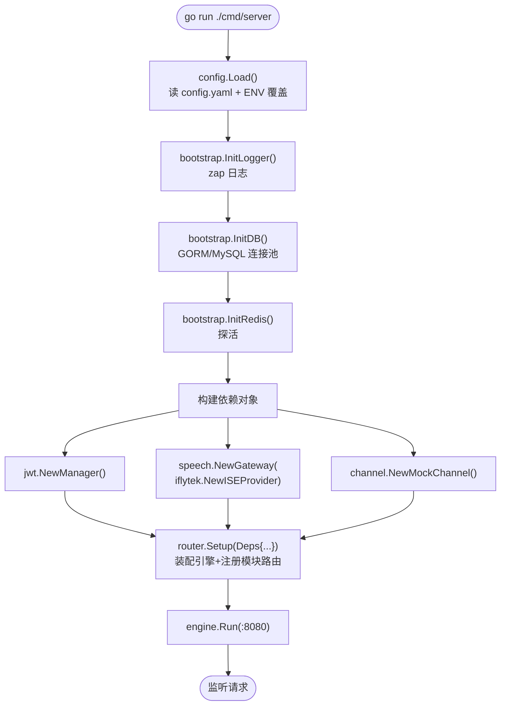
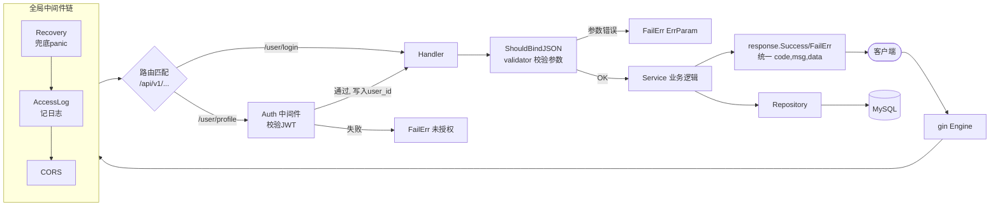
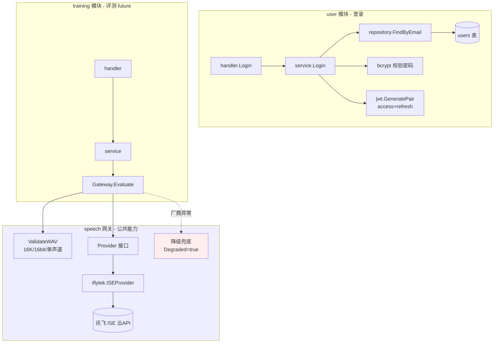

# EchoTalk 后台架构流程图

> 配合 gin 模块化单体骨架，帮助理解请求如何流转、各层如何协作。
> 关联文档：[目录结构方案](docs-echotalk-md-gin-cheeky-yao.md) · [完整技术方案](EchoTalk-技术方案.md)

---

## 1. 启动装配流程（main.go 干了什么）



所有依赖在 `main` 里**一次性创建**，再通过 `router.Deps` 注入各模块。模块不自己 new 数据库/密钥，这叫**依赖注入**，方便测试和替换（例如把 `MockChannel` 换成微信渠道，只改这一行）。

---

## 2. 请求生命周期（一个 HTTP 请求怎么走完）



理解要点：

- **中间件像洋葱皮**：请求先穿过 `Recovery → AccessLog → CORS`，需要登录的接口再加一层 `Auth`。
- `Auth` 通过后把 `user_id` 塞进 `gin.Context`，handler 用 `c.GetUint(ContextUserID)` 取。
- 任何一层出错都走**统一响应** `FailErr`，永远返回 `{code,msg,data}`，不会裸抛 500。

---

## 3. 分层调用（以「登录」和「语音评测」为例）



这张图体现两条硬约束：

- **业务模块只调 `speech.Gateway` 接口**，绝不 import `iflytek` —— 换厂商只新增一个 `Provider` 实现。
- **讯飞挂了走降级**（返回 `Degraded=true`），不把 500 抛给用户。

---

## 4. 整体依赖方向（一句话记住）

```
handler → service → repository → DB
            ↓
   speech.Gateway / channel.PaymentChannel（只依赖接口）
```

**依赖只能从上往下、从具体指向接口**，永远不会反过来。这就是「模块化单体」能日后拆微服务的根本原因——每个 `module/` 包自带四层、边界清晰。

---

## 5. 目录与图的对应关系

| 图中节点 | 代码位置 |
|---|---|
| config.Load | `internal/config/config.go` |
| bootstrap.Init* | `internal/bootstrap/` |
| 中间件链 | `internal/middleware/` |
| router.Setup / Deps | `internal/router/router.go` |
| handler/service/repository | `internal/module/<模块>/` |
| 统一响应 / 错误码 | `internal/pkg/response/`、`internal/pkg/errcode/` |
| JWT | `internal/pkg/jwt/jwt.go` |
| speech 网关 / Provider | `internal/speech/`、`internal/speech/iflytek/` |
| 支付适配器 | `internal/module/payment/channel/` |
